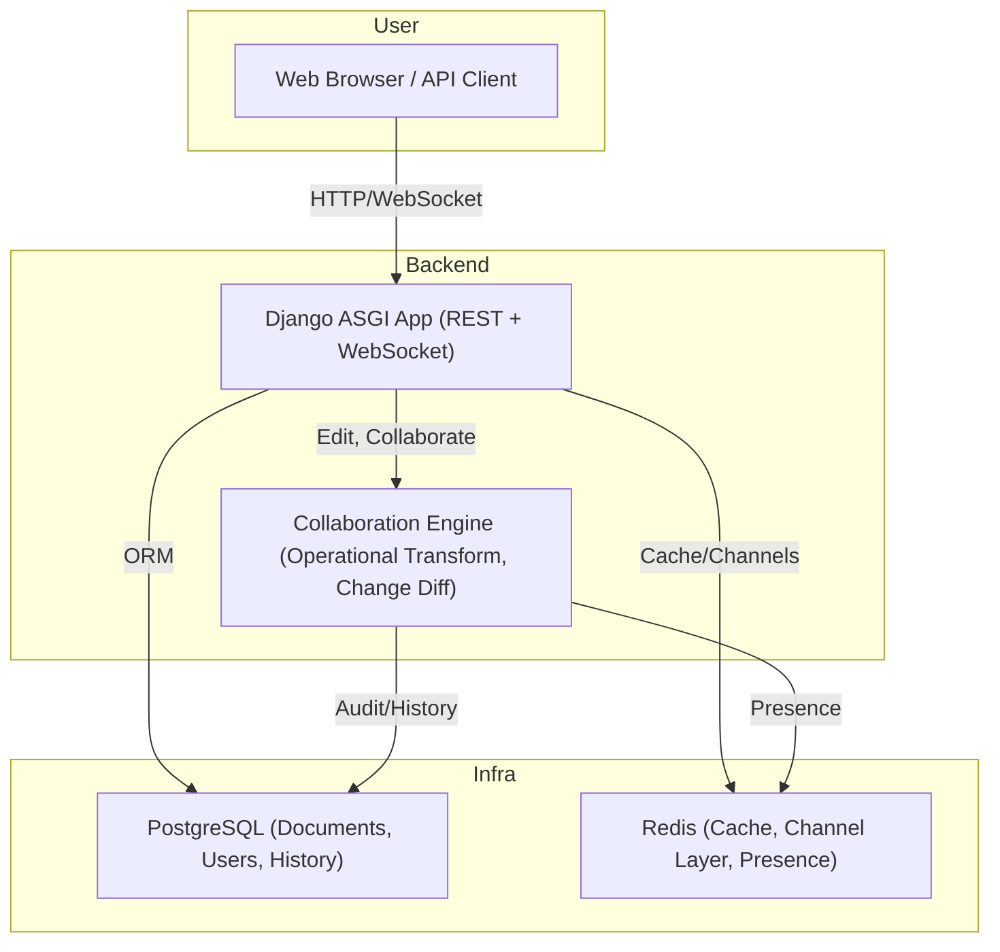

# Document Service

A distributed, real-time document editing platform built with Django, PostgreSQL, Redis, and Docker. Supports both API and web interfaces, advanced operational transform (OT) based editing, and robust audit trails for document changes.

---

## Features

- **Multi-user collaborative editing**
- **Versioned documents** with change history & audit trails
- **Operational Transform** system for intelligent conflict resolution
- **REST API** for document management, full-text search, and change operations
- **Web interface** with live presence, and typing indicators
- **Optimistic locking** (ETag-based) for safe concurrent editing
- **Advanced search**: PostgreSQL full-text search integration
- **Anonymous and authenticated user support**
- **Service health endpoints** for monitoring

---
---

## Architecture Overview



**Explanation:**
- **User:** Interacts via browser or external API client.
- **Backend:** Django ASGI app handles both REST API and WebSocket connections; collaboration engine manages editing and operational transform logic.
- **Infra:** PostgreSQL stores documents, users, and change history; Redis is used for caching, and live presence tracking.

---


## Technology Stack

- **Frontend**: Bootstrap 5, Alpine.js, HTMX, AJAX
- **Backend**: Django 4+, Django REST Framework, Django Channels
- **Infra**: PostgreSQL 15, Redis 7, Docker Compose
- **Collaboration**: Operational Transform (custom Python engine)
- **Testing**: pytest, Django test client, container-based integration tests

---

## Quick Start Guide

### 1. Prerequisites

- Docker + Docker Compose
- Python 3.11+ (for local dev, if not using Docker)
- [Poetry](https://python-poetry.org/) (for local dependency management)

### 2. Clone the Repository

```sh
git clone https://github.com/yashnalla/document_service.git
cd document_service
```

### 3. First-Time Setup (Recommended)

Run the following command for a fresh development environment:

```sh
make dev-setup-fresh
```
Remember to take note of the user tokens generated when running a fresh setup. You'll need it for the Postman collection below

### 4. Access the Application

- **Web UI**: [http://localhost:8000/documents/](http://localhost:8000/documents/)
- **Admin**: [http://localhost:8000/admin/](http://localhost:8000/admin/)
- **API Root**: [http://localhost:8000/api/](http://localhost:8000/api/)
- **Health Check**: [http://localhost:8000/health/](http://localhost:8000/health/)

Or check health directly:
```sh
make health
```

### 5. View Logs

To view logs from all services:

```sh
make logs
```

### 6. Run Tests

```sh
make test           # Run the test suite
make test-coverage  # Run tests with coverage
make perf-test      # Run isolated performance tests check out /performance_tests for more detail
```

---

**Tip:** Run `make help` to see all available Makefile commands and their descriptions.

---

## API Highlights

- `GET /api/documents/` – List/search documents
- `POST /api/documents/` – Create document
- `PATCH /api/documents/{id}/changes/` – Apply OT operations
- `POST /api/documents/{id}/preview/` - Preview OT operations
- `GET /api/documents/{id}/history/` – Change history
- `GET /api/documents/search/` – Full-text search

You can interact with the API with this [Postman Collection](https://web.postman.co/4fc61f9e-988c-460e-b7b8-80fd18aacbe6)
---

## Contributing

1. Fork the repo & clone locally
2. Create a branch: `git checkout -b feature/my-feature`
3. Commit & push
4. Open a PR on GitHub

---
